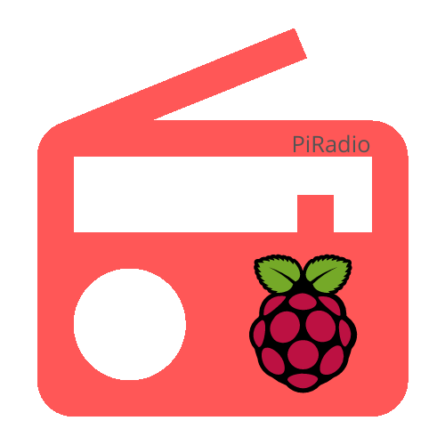

#   PiRadio 
[](https://travis-ci.com/PiRadioApp/PiRadioApp)
## Description
```
Simple embedded radio player.
Control device radio via local website and play online radio from given stream URL on Linux (e.g. Raspberry Pi).
```
## Features:
- playing radio from any audio stream,
- remote control and manage through web: local website, http rest api, 
- database in json file -> easy to manage,

## Whats more:
- colorfull console logs from engine and server,
- logs saved to file,

## Technology
| Engine | Server | Tests |
| :-: | :-: | :-: |
| C/C++ | Golang | C++/Python |

### External frameworks and Libs
| Engine | Server | Tests |
| :-: | :-: | :-: |
| gstreamer | zmq | gtest |
| zmq |  | termcolor |
| nlohmann::json | | pyzmq |

## Simple user manual
## How to use
### Simple user manual:
1. deploy app on linux (especially usefull with raspberry pi (ver 3B/4)),
2. add station - url address to radio stream,
3. plug raspberry to audio device (speakers),
4. play and enjoy your favourite online radio, and control it through the website.

### Install
install deb


## [USER MANUAL](docs/user_manual.md)
## [DEVELOPER MANUAL](docs/developer_manual.md)

## [More about deploy and use you can read here.](docs/README.md)
