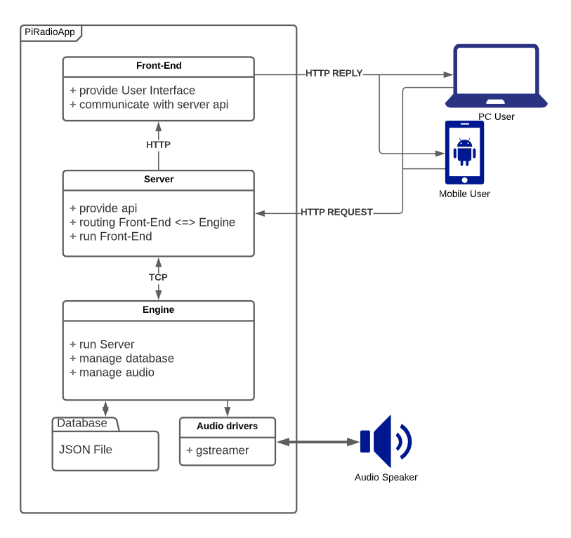

# PiRadio Documentation

## Table of context
---
1. [User manual](user_manual.md)
2. [Developer manual](developer_manual.md)
---
3. [Engine description](engine.md)
4. [Server description](server.md)
---

## Technology
| Engine | Server | Tests |
| :-: | :-: | :-: |
| C/C++ | Golang | C++/Python |

### External frameworks and Libs
| Engine | Server | Tests |
| :-: | :-: | :-: |
| gstreamer | zmq | gtest |
| zmq |  | termcolor |
| nlohmann::json | | pyzmq |

Simple app scheme:

